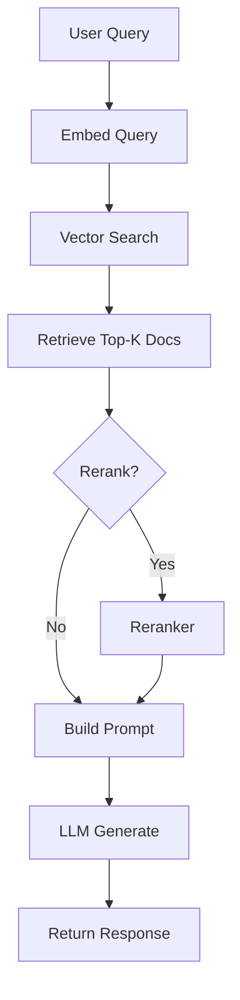
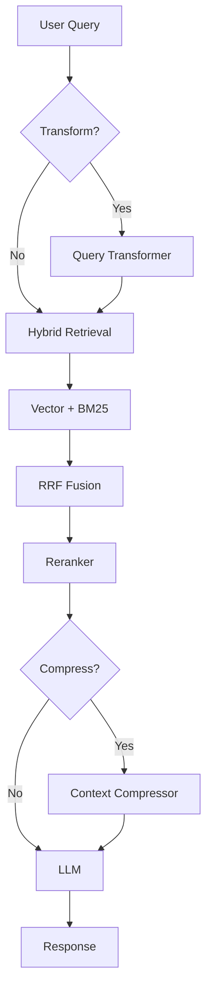

# Architecture

Understanding the FastRAG system architecture.

## Overview

FastRAG follows a modular, layered architecture based on SOLID principles.

```
┌─────────────────────────────────────────┐
│         User Interface Layer            │
│     (Streamlit / Python API)            │
└─────────────────────────────────────────┘
                 │
┌─────────────────────────────────────────┐
│      Core RAG Orchestration Layer       │
│          (RAGChatbot)                   │
└─────────────────────────────────────────┘
                 │
┌─────────────────────────────────────────┐
│        Component Layer (Interfaces)     │
├──────────┬──────────┬──────────┬────────┤
│ Loaders  │Embedders │  Stores  │  LLMs  │
└──────────┴──────────┴──────────┴────────┘
                 │
┌─────────────────────────────────────────┐
│     Advanced Features Layer             │
├────────┬─────────┬──────────┬───────────┤
│Retrieval│Reranking│Transform │ Agents   │
└────────┴─────────┴──────────┴───────────┘
```

## SOLID Principles

### Single Responsibility Principle (S)
Each class has one clear responsibility:
- `UniversalLoader` - Load documents
- `MiniLMEmbedder` - Generate embeddings
- `ChromaVectorStore` - Store and search vectors
- `OllamaLLM` - Generate text

### Open/Closed Principle (O)
Components are open for extension, closed for modification:
```python
# Easy to add new loaders
class CustomLoader(IDocumentLoader):
    def load(self, source: str) -> List[Documento]:
        # Custom implementation
        pass
```

### Liskov Substitution Principle (L)
Components are interchangeable via interfaces:
```python
# Any ILocalLLM can be used
llm = OllamaLLM(model_name="llama3")  # Or
llm = MockLLM()  # For testing
```

### Interface Segregation Principle (I)
Small, focused interfaces:
- `IDocumentLoader` - Just `load()`
- `IEmbeddingModel` - `embed_documents()` and `embed_query()`
- `IVectorStore` - `add()` and `search()`
- `ILocalLLM` - `generate()`

### Dependency Inversion Principle (D)
Depend on abstractions, not implementations:
```python
class RAGChatbot:
    def __init__(
        self,
        loader: IDocumentLoader,  # Interface, not concrete class
        embedder: IEmbeddingModel,
        store: IVectorStore,
        llm: ILocalLLM
    ):
```

## Core Components

### 1. Document Loader (`IDocumentLoader`)
**Responsibility**: Load documents from various sources.

**Implementations**:
- `UniversalLoader` - Handles TXT, MD, PDF, DOCX

**Interface**:
```python
def load(source: str) -> List[Documento]:
    """Load documents from source."""
```

### 2. Embedding Model (`IEmbeddingModel`)
**Responsibility**: Convert text to vector embeddings.

**Implementations**:
- `MiniLMEmbedder` - Uses SentenceTransformers

**Interface**:
```python
def embed_documents(texts: List[str]) -> List[List[float]]:
    """Embed multiple documents."""
    
def embed_query(text: str) -> List[float]:
    """Embed a single query."""
```

### 3. Vector Store (`IVectorStore`)
**Responsibility**: Store and retrieve vectors.

**Implementations**:
- `ChromaVectorStore` - ChromaDB-based storage

**Interface**:
```python
def add(documents: List[Documento], embeddings: List[List[float]]):
    """Add documents with their embeddings."""
    
def search(query_embedding: List[float], k: int) -> List[Documento]:
    """Search for similar documents."""
```

### 4. Local LLM (`ILocalLLM`)
**Responsibility**: Generate text responses.

**Implementations**:
- `OllamaLLM` - Ollama integration
- `MockLLM` - For testing

**Interface**:
```python
def generate(prompt: str, images_base64: List[str] = None) -> str:
    """Generate text from prompt."""
```

## RAG Pipeline

### 1. Ingestion Phase

```
Documents → Loader → Text Splitter → Embedder → Vector Store
```

1. **Load**: `UniversalLoader` reads files
2. **Split**: Optional `TextSplitter` chunks text
3. **Embed**: `MiniLMEmbedder` creates vectors
4. **Store**: `ChromaVectorStore` persists vectors

### 2. Query Phase

```
Query → Embedder → Vector Store → Retrieval → LLM → Response
```

1. **Embed**: Convert query to vector
2. **Search**: Find similar documents
3. **Retrieve**: Get top-k relevant docs
4. **Generate**: LLM creates answer

## Advanced Components

### Retrieval Strategies

- **VectorRetriever**: Semantic search only
- **BM25Retriever**: Lexical search (term frequency)
- **HybridRetriever**: Combines both with RRF (Reciprocal Rank Fusion)

### Reranking

- **CrossEncoderReRanker**: Rerank results for better relevance
- **MockReRanker**: For testing

### Query Transformation

- **QueryTransformer**: Expand, decompose, or rephrase queries

### Context Compression

- **PromptCompressor**: Reduce context size to fit LLM limits

### Agents

- **Agent**: ReAct-style reasoning agent
- **CrewAgent**: Multi-agent collaboration
- **Tools**: Calculator, RAG search, etc.

## Data Flow

### Complete RAG Flow



### With Advanced Features



## Testing Architecture

Tests are organized by type:

- **Unit Tests**: Test individual components in isolation
- **Integration Tests**: Test component interactions
- **E2E Tests**: Test complete workflows

Coverage: **62%+**

## Design Patterns Used

1. **Strategy Pattern**: Interchangeable algorithms (retrievers, rerankers)
2. **Factory Pattern**: Component creation
3. **Template Method**: Base classes with hooks
4. **Dependency Injection**: Components injected via constructor
5. **Repository Pattern**: Vector store abstraction

---

← [Quick Start](Quick-Start.md) | [Components](Components.md) →
